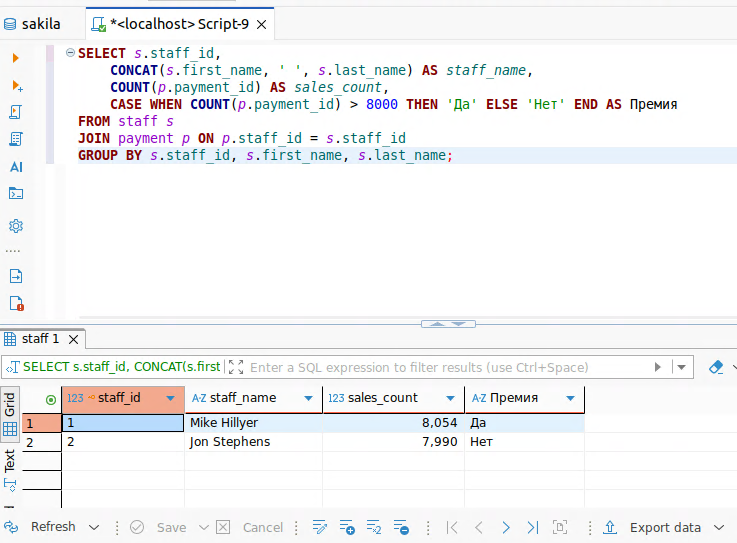

# Домашнее задание к занятию «SQL. Часть 2» - Лунев Федор Владимирович

### Задание 1

Одним запросом получите информацию о магазине, в котором обслуживается более 300 покупателей, и выведите в результат следующую информацию: 
- фамилия и имя сотрудника из этого магазина;
- город нахождения магазина;
- количество пользователей, закреплённых в этом магазине.

---

```sql
SELECT
    s.last_name,
    s.first_name,
    c.city,
    COUNT(*) AS customers_count
FROM store st
JOIN staff s ON s.staff_id = st.manager_staff_id
JOIN address a ON a.address_id = st.address_id
JOIN city c ON c.city_id = a.city_id
JOIN customer cu ON cu.store_id = st.store_id
GROUP BY st.store_id, s.staff_id, s.last_name, s.first_name, c.city
HAVING COUNT(*) > 300;
```


### Задание 2

Получите количество фильмов, продолжительность которых больше средней продолжительности всех фильмов.

---

```sql
SELECT COUNT(*) AS films_longer_than_average
FROM film
WHERE length > (SELECT AVG(length) FROM film);
```


### Задание 3

Получите информацию, за какой месяц была получена наибольшая сумма платежей, и добавьте информацию по количеству аренд за этот месяц.

---

```sql
SELECT month, total_payments, total_rentals
FROM (
    SELECT
        DATE_FORMAT(p.payment_date, '%Y-%m') AS month,
        SUM(p.amount) AS total_payments,
        COUNT(DISTINCT r.rental_id) AS total_rentals,
        RANK() OVER (ORDER BY SUM(p.amount) DESC) AS rnk
    FROM payment p
    LEFT JOIN rental r ON r.rental_id = p.rental_id
    GROUP BY DATE_FORMAT(p.payment_date, '%Y-%m')
) t
WHERE rnk = 1;
```


### Задание 4*

Посчитайте количество продаж, выполненных каждым продавцом. Добавьте вычисляемую колонку «Премия». Если количество продаж превышает 8000, то значение в колонке будет «Да», иначе должно быть значение «Нет».

---

```sql
SELECT s.staff_id,
    CONCAT(s.first_name, ' ', s.last_name) AS staff_name,
    COUNT(p.payment_id) AS sales_count,
    CASE WHEN COUNT(p.payment_id) > 8000 THEN 'Да' ELSE 'Нет' END AS Премия
FROM staff s
JOIN payment p ON p.staff_id = s.staff_id
GROUP BY s.staff_id, s.first_name, s.last_name;
```



### Задание 5*

Найдите фильмы, которые ни разу не брали в аренду.

---

```sql
SELECT f.film_id, f.title
FROM film f
WHERE NOT EXISTS (
    SELECT 1
    FROM inventory i
    JOIN rental r ON r.inventory_id = i.inventory_id
    WHERE i.film_id = f.film_id
);
```


---